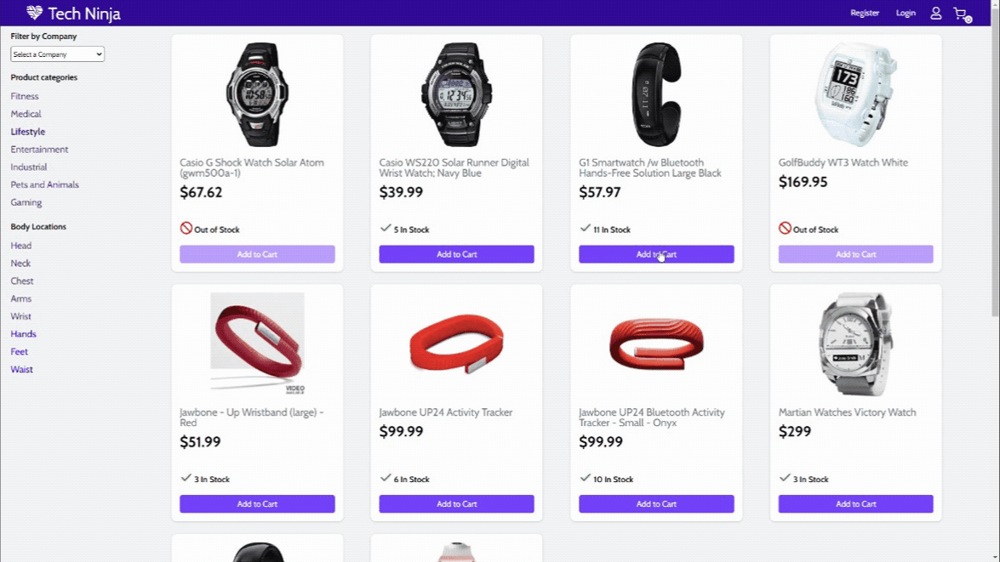
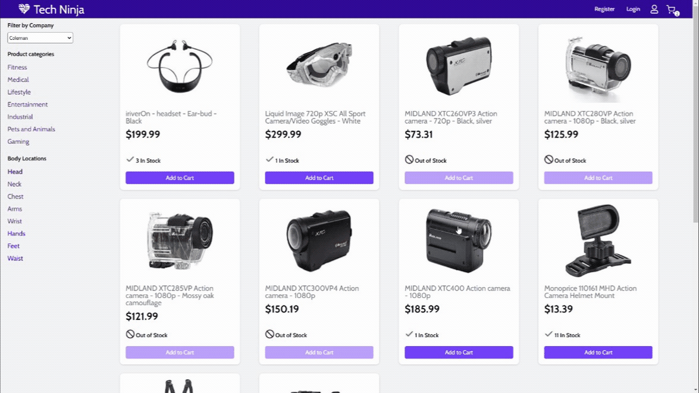

# Wearables E-Commerce Project

We created an E-commerce website to display different types of wearable technology. Although users cannot currently purchase the products, it does simulate a purchase without the transaction information and updates stock quantities as well.

The stack is React.Js, Redux, Express, Node.Js.

The node server should be RESTful and follow REST principles, at least to the extent we learned during the bootcamp.

Created in collaboration with

Donitha Michael, @DonithaM - https://github.com/DonithaM

Aude Hébert, @Audehd - https://github.com/Audehd

Vahan, vahan-kali, @vahan-kali- https://github.com/vahan-kali

Under the supervision of

Vicky Wang, @vickywvng - https://github.com/vickywvng

https://user-images.githubusercontent.com/44169593/117141394-7bd46880-ad7c-11eb-9d63-7c228e66f505.mp4

## Landing Page

## Add To Cart

## Clear Cart

## Features to Implement
  - [ ] Should add whimsical animations
  - [ ] Make the item filters run concurrently
  - [ ] Add a link back to the shop page from the item details page and cart
  - [ ] User Account implementation
